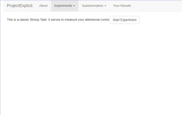

```{r, include = FALSE}
knitr::opts_chunk$set(
  collapse = TRUE,
  comment = "#>"
)
```

```{r setup, include = FALSE}
library(ProjectExplicit)
```

# Package Description
The `ProjectExplicit` package is a ShinyApp containing several different cognitive tasks and mental health questionnaires. The users of the app first choose which cognitive task they want to complete, and which mental health symptom questionnaire they want to fill out.

After completing the task and the questionnaire, the users receive personalized feedback on how well they did in the task, and where they stand on the scale of mental health symptom severity. They can also interact with the plots to see where they stand compared to others (i.e., the general population), and how the cognitive tasks relate to mental health symptoms.

# ProjectExplicit App Demo for Users
Let's have a quick look at different pages of the app!



## About
Here you can find more information about ProjectExplicit, it's basic ideas, background and what inspired the project.

## Experiments
Under the `Experiments` Menu, you can find a list of available tasks aimed at measuring different cognitive processes. For example, the Stroop task measuring attentional control, or a Digit Span task measuring working memory capacity. 

Each Experiment/Task page contains a short description of the task, as well as a button to launch the tasks.

## Questionnaires
Under the `Questionnaires` Menu, you can find a list of available mental health questionnaires. These questionnaires measure the levels of symptoms of various mental health problems, such as substance use or depression. 

Each Questionnaire page contains a short description of the questionnaire used, as well as a button to launch the survey.

## Your Results
`Your Results` page will show the user's personalized feedback after they've completed the tasks and questionnaires. It will show an interactive plot, where users can see where they stand in comparison to the general population, and check a what would happen if their task scores were different.

# Running the App
To run the app, the users should use RStudio, and initialize the app with the following code:

```
install.packages('ProjectExplicit')
library(ProjectExplicit)
startApp()
```
# For Developers and Researchers

[tbd]... Here you will find info in how the code works, and how you can use it as a template/starting point for your own project.
